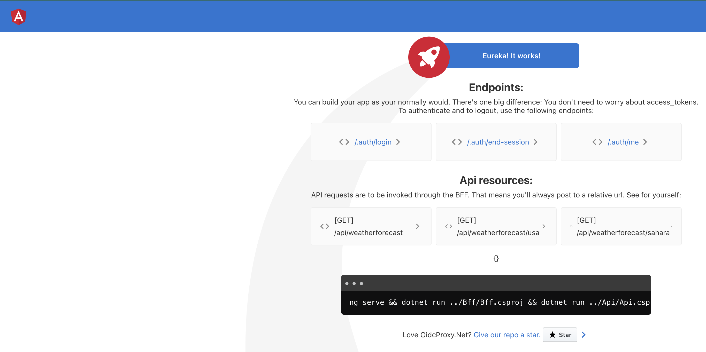

# Deploying the OIDC Proxy with Kubernetes

The guide below covers how to deploy the OIDC Proxy with Kubernetes.

## Testing the OIDC Proxy locally

### Prerequisites

- kubectl
- Either minikube or kind

### Create a namespace

It is common practice to assign a specific namespace for service isolation. You can do that as follows:

```shell
$ kubectl apply -f namespace.yaml
```

### Generate the required secrets and deploy them to Kubernetes

There are two YAML files that contain secrets. One is to authenticate with a private Docker registry and the other is for the Auth0 secrets.

#### Generate secrets for Docker private registry

To generate secrets to use the Docker private registry, Kubernetes provides a straightforward guide [here](https://kubernetes.io/docs/tasks/configure-pod-container/pull-image-private-registry/#log-in-to-docker-hub).

#### Generate secrets for your Auth0 application

To generate secrets to leverage your Auth0 application, please follow [this README](https://github.com/oidcproxydotnet/OidcProxy.Net/blob/main/docs/demos/Authentication-Gateways/Auth0/src/readme-auth0.md)

> **_NOTE:_** Make sure that the generated secrets from the steps above are added to the `docker-reg-secrets.yaml` and `oidcproxy-secrets.yaml` files.

### Create the OIDC Proxy API service

To create the API service, please add the location of your Docker image, then run the following:

```shell
$ kubectl apply -f oidcproxy-api.yaml
$ kubectl apply -f oidcproxy-api-service.yaml
```

### Create the OIDC Proxy SPA service

To create the SPA service, please add the location of your Docker image, then run the following:

```shell
$ kubectl apply -f oidcproxy-spa.yaml
$ kubectl apply -f oidcproxy-spa-service.yaml
```

### Create the OIDC Proxy BFF service

To create the BFF service, please add the location of your Docker image, then run the following:

```shell
$ kubectl apply -f oidcproxy-bff.yaml
$ kubectl apply -f oidcproxy-bff-service.yaml
```

After applying all the services, you can port forward the BFF service to test the proxy as follows:

```shell
$ kubectl port-forward -n oidcproxy svc/oidcproxy-bff-service 8443:8443
```

Then navigate to http://localhost:8443 and you should get the following:



You can click on `/.auth/login` and test out your application. If the flow works, congrats you have an OIDC proxy running on your local Kubernetes cluster.