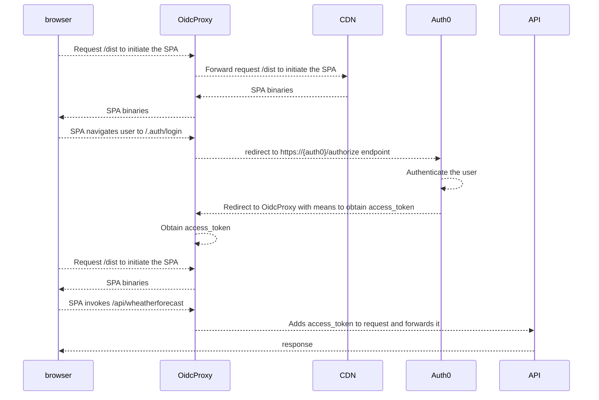

# Auth0 / BFF / SPA / API demo


This demo consists of four parts:

- Auth0, to authenticate users
- A CDN to host the SPA
- An ASP.NET Core BFF for authentication (the OidcProxy)
- An ASP.NET Core API

Prerequisites to run this demo:
- [Download and install the .NET 8 SDK](https://dotnet.microsoft.com/en-us/download)
- [Download and install NodeJS/NPM](https://nodejs.org/en/download)
- [Install the Angular CLI](https://angular.io/cli)
- Create an Auth0 instance and configure it as described [here](readme-auth0.md).

## How the demo works:



## Configure the demo

Configure the BFF:
* Open Bff/appsettings.json with your favorite editor
* Replace {yourClientId} with the clientid you have configured in Auth0.
* Replace {yourClientSecret} with the clientsecret you have configured in Auth0.
* Replace {yourDomain} with the domain you have just configured in Auth0.
* Replace {yourAudience} with the audience you have just configured in auth0 (in the API section).

Configure the API:
* Open api/appsettings.json with your favorite editor
* Replace {yourDomain} with the domain you have just configured in Auth0.
* Replace {yourAudience} with the audience you have just configured in auth0 (in the API section).

## Or run the demo using the CLI

* Open a terminal window or a command prompt
* Navigate to Api/
* Type `dotnet restore`
* Type `dotnet run`

* Open another terminal window or a command prompt
* Navigate to Bff/
* Type `dotnet restore`
* Type `dotnet run`

* Open another terminal window or a command prompt
* Navigate to Spa
* Type `npm install`
* Type `npm run start`

* Open a browser and navigate to https://localhost:8444

## Result

If you've followed these steps correctly, you should see:


## Run this demo with Docker

In case you haven't done so already, please create an Auth0 instance and configure it as described [here](readme-auth0.md).

Clone this repository and navigate to this folder on your local machine and open the `docker-compose.yml`. It has a section called `bff` and a section called `api`. Configure the following environment variables with the values you have configured in Auth0:

```yaml
version: '3.4'
services:
  bff:
...
    environment:
      - Auth0__ClientSecret={yourSecret}
      - Auth0__ClientId={yourClientId}
      - Auth0__Domain={yourDomain}
      - Auth0__Audience={yourAudience}
...

  api:
...
    environment:
      - Auth0__Domain={yourDomain}
      - Auth0__Audience={yourAudience}
```

Now, open powershell or terminal if you have a Mac and navigate to the folder where the `docker-compose.yml` is located and type the following command:

Powershell on Windows:
```powershell
.\build-and-run-with-docker.ps1
```

Terminal on Mac:
```powershell
brew install --cask powershell
pwsh build-and-run-with-docker.ps1
```

This scripts builds the API, the BFF, and the SPA and then executes `docker compose up -d`. After the script has completed, open a browser and navigate to `http://localhost:8443`.