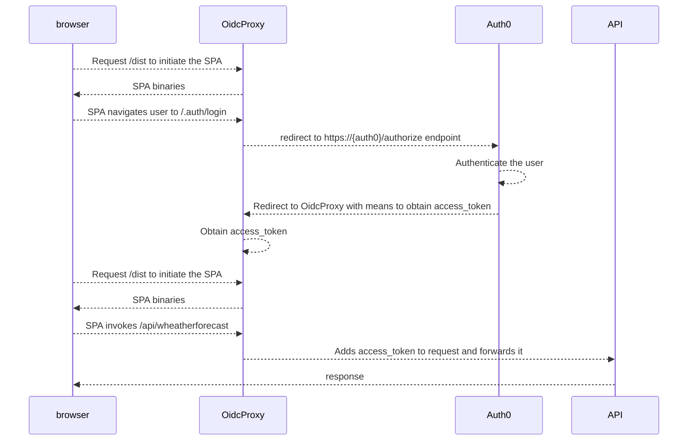

# Auth0 / Spa+BFF / API demo

This demo consists of three parts:

- Auth0, to authenticate users
- A SPA, hosted in an ASP.NET Core BFF (the OidcProxy)
- An ASP.NET Core API

Prerequisites to run this demo:
- [Download and install the .NET 8 SDK](https://dotnet.microsoft.com/en-us/download)
- [Download and install NodeJS/NPM](https://nodejs.org/en/download)
- [Install the Angular CLI](https://angular.io/cli)
- Create an Auth0 instance and configure it as described [here](readme-auth0.md).

## How the demo works:

## Configure the demo

Configure the BFF:
* Open spa+bff/appsettings.json with your favorite editor
* Replace {yourClientId} with the clientid you have configured in Auth0.
* Replace {yourClientSecret} with the clientsecret you have configured in Auth0.
* Replace {yourDomain} with the domain you have just configured in Auth0.
* Replace {yourAudience} with the audience you have just configured in auth0 (in the API section).

Configure the API:
* Open api/appsettings.json with your favorite editor
* Replace {yourDomain} with the domain you have just configured in Auth0.
* Replace {yourAudience} with the audience you have just configured in auth0 (in the API section).

## Run the demo using Visual Studio/JetBrains Rider

* Open demo.sln
* Right-click the Api project and click `run`.
* Right-click the spa+bff project and click `run`.

## Or run the demo using the CLI

* Open a terminal window or a command prompt
* Navigate to api/
* Type `dotnet restore`
* Type `dotnet run`

* Open another terminal window or a command prompt
* Navigate to spa+bff/
* Type `dotnet restore`
* Type `dotnet run`

* Open a browser and navigate to https://localhost:8444

## Result

If you've followed these steps correctly, you should see:

## Issues

Not working? Missing features? Create an [issue](https://github.com/oidcproxydotnet/oidcproxy.net/issues).