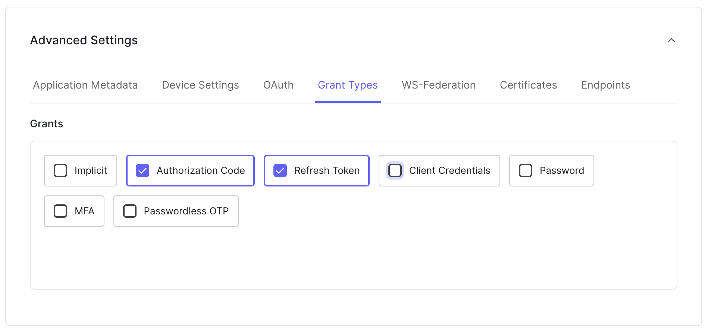

# GoCloudNative.Bff.Authentication.Auth0

This package contains the software you need to implement the BFF Security Pattern. This software does three things:

1. It manages the user session
2. It allows the user to log into the site
3. It forwards request to downstream services and adds the Authorization header with the user's access token to the requests

The GoCloudNative BFF is a stateful reverse proxy. To forwared requests to downstream services GoCloudNative BFF uses YARP.

Currently, GoCloudNative BFF supports logging in with OpenId Connect and with Auth0. Currently, only the Authorization Code flow with Proof-Key Client Exchange is supported.

## Quickstart: Implementing the BFF Security Pattern with Auth0

To build a BFF, execute the following commands:

```bash
dotnet new web
dotnet add package GoCloudNative.Bff.Authentication
dotnet add package GoCloudNative.Bff.Authentication.Auth0
```

Create the following `Program.cs` file:

```csharp
using GoCloudNative.Bff.Authentication.Auth0;
using GoCloudNative.Bff.Authentication.ModuleInitializers;

var builder = WebApplication.CreateBuilder(args);

builder.Services.AddSecurityBff(o =>
{
    o.ConfigureAuth0(builder.Configuration.GetSection("Auth0"));
    o.LoadYarpFromConfig(builder.Configuration.GetSection("ReverseProxy"));
});

var app = builder.Build();

app.UseRouting();

app.UseSecurityBff();

app.Run();

```

Create the following `appsettings.json` file:

```json
{
  "Logging": {
    "LogLevel": {
      "Default": "Information",
      "Microsoft.AspNetCore": "Warning"
    }
  },
  "Auth0": {
    "ClientId": "[InsertClientIdHere]",
    "ClientSecret": "[InsertClientSecretHere]",
    "Authority": "https://authority",
    "Scopes": [
      "openid", "profile", "offline_access"
    ]
  },
  "AllowedHosts": "*",
  "ReverseProxy": {
    "Routes": {
      "spa": {
        "ClusterId": "spa",
        "Match": {
          "Path": "/{*any}"
        }
      },
      "api": {
        "ClusterId": "api",
        "Match": {
          "Path": "/api/{*any}"
        }
      },
    },
    "Clusters": {
      "spa": {
        "Destinations": {
          "spa": {
            "Address": "http://localhost:4200/"
          }
        }
      },
      "api": {
        "Destinations": {
          "api": {
            "Address": "http://localhost:8080/"
          }
        }
      },
    }
  }
}

```

In this example we assume you are running a Single Page Application on localhost on port `4200` and you have an API running at localhost on port `8080`. If that is not the case, then update the `appsettings.json` accordingly.

To run the BFF, type `dotnet run` or just hit the 'play'-button in Visual Studio.

## Configuring Auth0

This software only supports the Authorization Code Flow with Proof Key for Client Exchange. That's why it is important to configure Auth0 in a specific way. 

Follow these steps to configure Auth0 correctly:

* Go to https://manage.auth0.com and sign in
* Go to the `Applications` section in the menu on the left-hand side and click `Applications`
* Click `+ Create application` in the right upper corner
* Provide a name for your app and select `Regular web applications`
* Now, click settings, now you'll see the following section:


* Copy the client_id, the secret, and the authority into the `appsettings.json`, like so:

```json
{
  ...
  "Auth0": {
    "ClientId": "iuw4kjwkj34kj3",
    "ClientSecret": "kjh423j43jkh43jk2443jhsdfgs345te4th",
    "Authority": "example.eu.auth0.com",
    "Scopes": [
      "openid", "profile", "offline_access"
    ]
  }
  ...
}
```

* Next, scroll to the `Advanced settings` and configure the `grant_types`. Enable `Authorization Code` and `Refresh tokens`



## Endpoints

The BFF relays all requests as configured in the `ReverseProxy` section in the `appsettings.json` file, except for four endpoints:

### [GET] /account/login
To log a user in and to start a http session, navigate to `/account/login`. The software will redirect to the login page of the Identity Provider to log the user in. The resulting tokens will be stored in the user session and are not available in the browser.

### [GET] /account/login/callback
This endpoint is used by the IdentityProvider.

### [GET] /account/me
To see the logged in user, navigate to the `/account/me` endpoint. This endpoint shows the claims that are in the `id_token`.

### [DELETE] /account/session
To revoke the tokens that have been obtained when the user logged in, execute a delete request on the `/account/delete` endpoint. This will revoke the tokens that have been stored in the user session. __This will not log the user out from the Identity Provider session. This must be implemented at client side.__

## Issues

Are you encountering issues? Please let us know at: https://github.com/thecloudnativewebapp/GoCloudNative.Bff/issues